# ubi8-nodejs-rdbg Remote Debug using Node.js express app on openshift


## Idea

The main idea is to demonstrate how to start remote debug Node.js application using different base images. Base on this demo you can see that RedHat UBI8 image has all necessary tools for switch on remote debug mode in contrast of Alpina image which need some additianl development.  For Alpina image I start application using simple sh script **apprun.sh**:

```bash
#!/bin/bash

run_node() {
  if [ -z "$DEBUG_PORT" ]; then
     export DEBUG_PORT=5858
  fi

  if [ -z "$NPM_RUN" ]; then
     export NPM_RUN=start
  fi
}
run_node
echo "Launching via npm..."
exec npm run -d $NPM_RUN
```

## Folder assignments

- nodesrvcbe contains a simple Node.js express applicaiton
- openshift  contains different deployments approaches on openshift
    * openshift/s2i_deployment deployment from source code on github
    * openshift/ubi8_docker_deployment deployment from Dockerfile in github using RedHat UBI8-Node.js image
    * openshift/alpina_docker_deployment  deployment from Dockerfile in github using DockerHub alpina-Node.js image 
    * .vscode  contains file **launch.json** which contains configuration for debug: local and remote.

## run Node.js app  on you laptop

1. clone git hub repo

```bash
  git clone https://github.com/pavlo-shcherbukha/ubi8-nodejs-rdbg.git

```
2. install dependency

```bash
    npm install
```
3. run application running mode

3.1. using command line
    
```bash
    npm start
```
Your application will listen  port 8080
You can raeach services  using url: 
- http://localhost:8080 ;
- http://localhost:8080/users .

http://localhost:8080/users returns json  like in example

```json

[
    {
        "user_id": 1,
        "username": "usr1",
        "fullname": "Petro Petrovnch"
    },
    {
        "user_id": 2,
        "username": "usr2",
        "fullname": "Semen Semenov"
    },
    {
        "user_id": 3,
        "username": "usr3",
        "fullname": "Odarka Petrivna"
    }
]
```
3.2. run application in debug mode on your laptop

Select appropriate configuration and run as shown on [pic-01](#pic-01)


<kbd>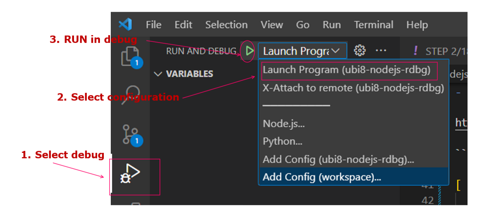</kbd>
<p style="text-align: center;"><a name="pic-01">pic-01</a></p>

3.2. run application in debug mode on your laptop using JavaScript Debug Terminal

- Change folder using

```bash
cd nodesrvcbe 
```

- Select JavaScript debug terminal  as shown on [pic-02](#pic-02)

<kbd>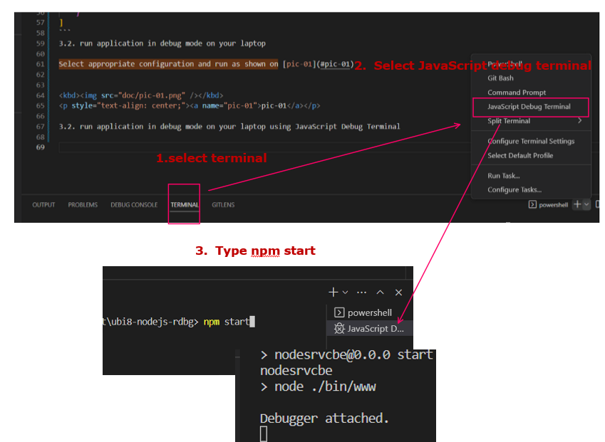</kbd>
<p style="text-align: center;"><a name="pic-02">pic-02</a></p>


4. run application on OpenShift

4.1. Prepare openhsift environment

- run openshift sandbox as described here [create openshift sendbox](https://github.com/pavlo-shcherbukha/google-sheet-to-db#create-openshift-sendbox).  Personally I prefer this variant.

- install and run openshift crc platform [ A minimal OpenShift Container Platform 4 cluster and Podman container runtime to your local computer](https://crc.dev/crc/).

- use your corporate openshift if it possible.

4.2. Modify login.cmd  according to your openshift credentials

Modify login.cmd as shown on  [pic-03](#pic-03)

<kbd>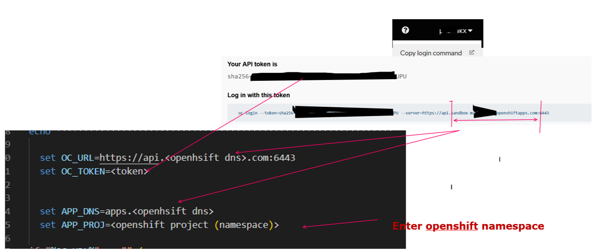</kbd>
<p style="text-align: center;"><a name="pic-03">pic-03</a></p>


4.3. Create your github secret

- Modify  secret-github-basicauth.yaml  according to your githyb credentials

- create secret using 

```bash
 oc create -f secret-github-basicauth.yaml
```

4.4. Deploy  service 

The folders openshift/s2i_deployment, openshift/ubi8_docker_deployment, openshift/alpina_docker_deployment  contain 2 cmd files:
- srvc-process.cmd  which creates the service;
- route-process.cmd which creates the route.  

If all 3 services are deployed successfully, you might see something like this [pic-04](#pic-04):

<kbd>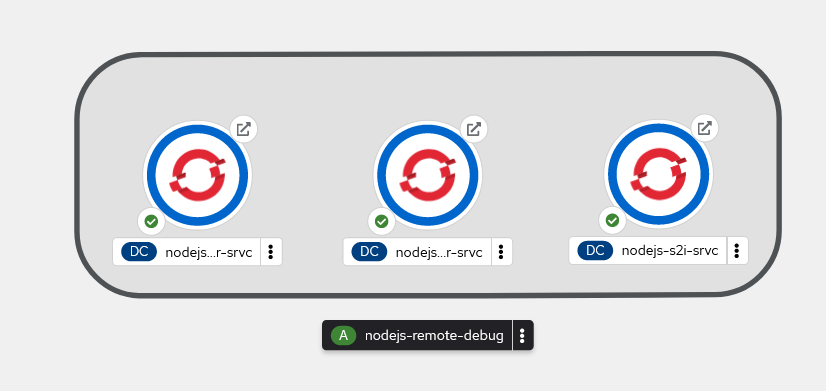</kbd>
<p style="text-align: center;"><a name="pic-04">pic-04</a></p>

5. Prepare remote debug

5.1. Check remote debug configuration in Visual Studio Code in file **.vscode/launch.json** and package.json.

On [pic-05](#pic-05) you can see remote debug configuration for  **openshift/s2i_deployment**, **openshift/ubi8_docker_deployment**.

<kbd>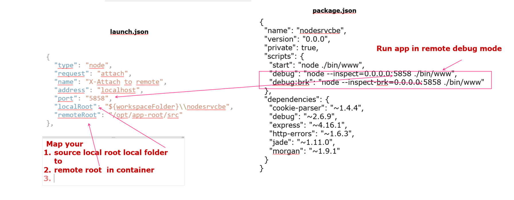</kbd>
<p style="text-align: center;"><a name="pic-05">pic-05</a></p>

For **openshift/alpina_docker_deployment** application  sources have copied on /app folder. It means that in **launch.json**   **"remoteRoot"** should be like this

```text
"remoteRoot": "/app"

```

5.2. Change environment variable on container

In order to start debug you shold change default start comand in env variable **NPM_RUN**  as shown on [pic-06](#pic-06):

<kbd>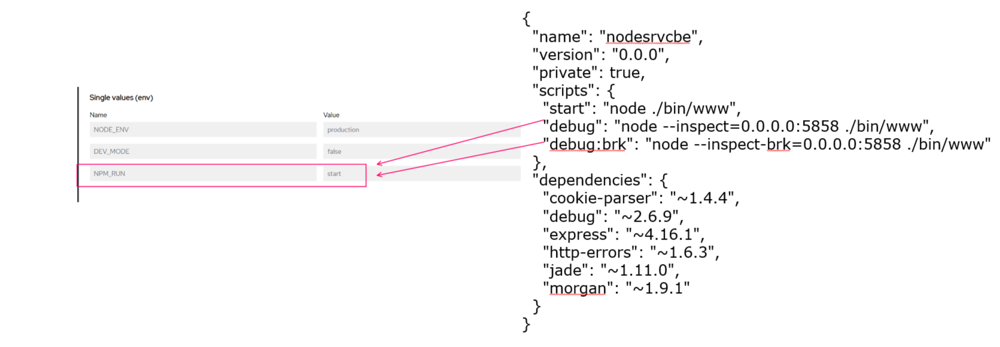</kbd>
<p style="text-align: center;"><a name="pic-06">pic-06</a></p>

For instanse, let's change **NPM_RUN**  to 'debug:brk' and see log in conteiner after it's restart [pic-07](#pic-07)


<kbd>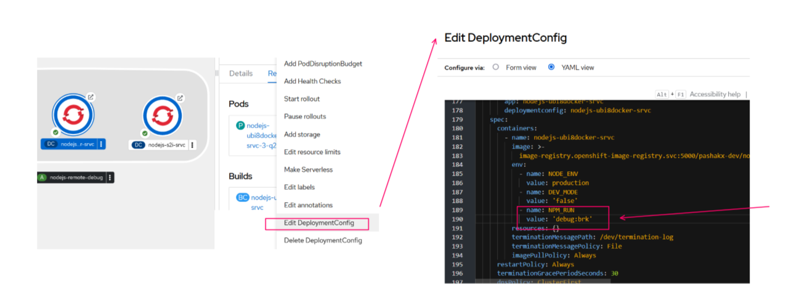</kbd>
<p style="text-align: center;"><a name="pic-07">pic-07</a></p>


After pod restarting  you should see something like  [pic-08](#pic-08) in container log


<kbd>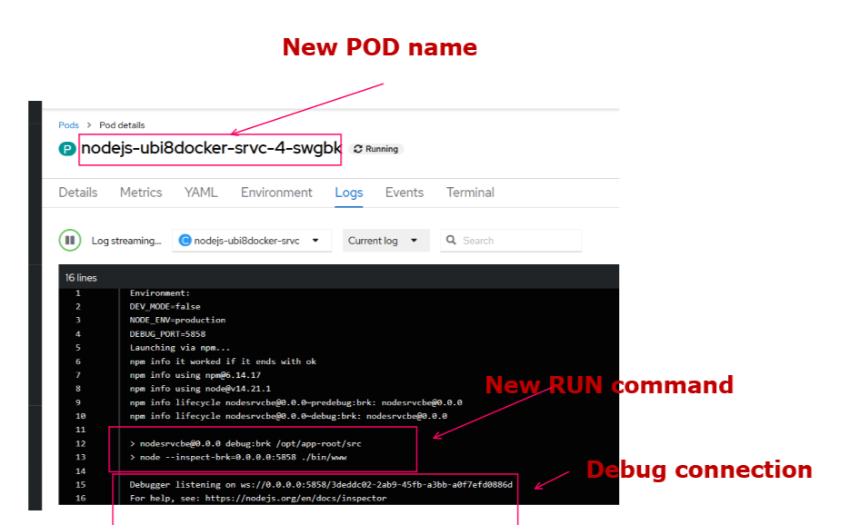</kbd>
<p style="text-align: center;"><a name="pic-08">pic-08</a></p>


5.3. Port forward container debug port to the port on your laptop.

To forward container debug port to the port on your laptop you should run the  openshift command:

```bash
oc  port-forward nodejs-ubi8docker-srvc-4-swgbk 5858:5858

```
where **nodejs-ubi8docker-srvc-4-swgbk** the pod name from  [pic-08](#pic-08).  In case of successful  command execution you can see something like this [pic-09](#pic-09) i:

<kbd>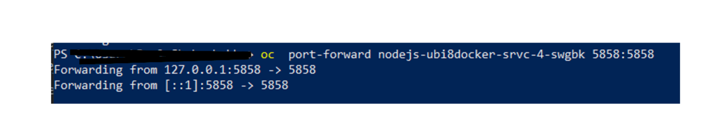</kbd>
<p style="text-align: center;"><a name="pic-09">pic-09</a></p>

5.4. Connect Visual Studit Code to debug


Attach to container  in 3 steps as shown on  [pic-10](#pic-10) 

<kbd>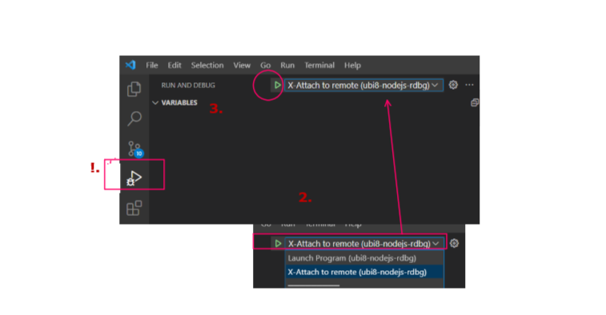</kbd>
<p style="text-align: center;"><a name="pic-10">pic-10</a></p>

and start debugging, tracing, set breakpoints as shown on   [pic-11](#pic-11).

<kbd>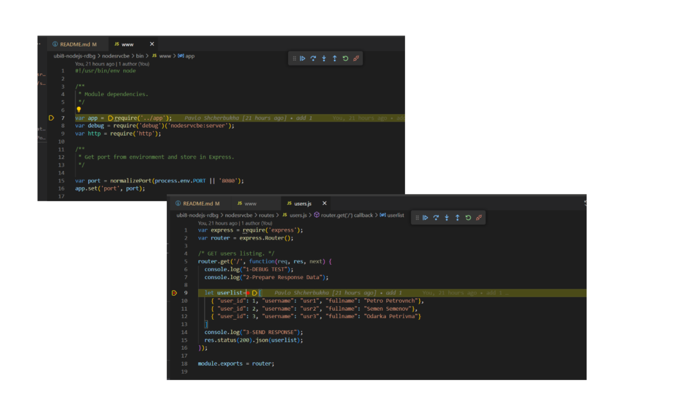</kbd>
<p style="text-align: center;"><a name="pic-11">pic-11</a></p>


